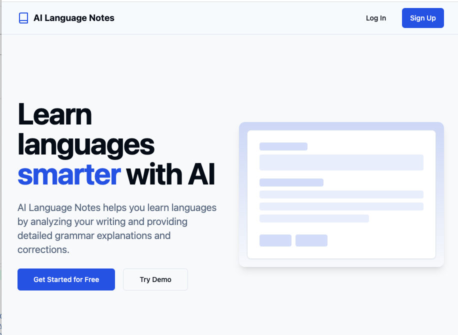
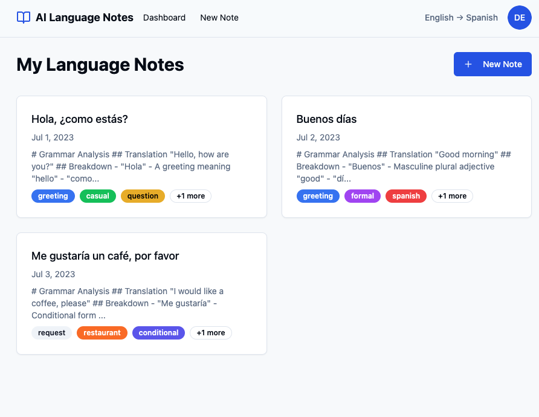

# AI Language Notes

A language learning assistant application that uses AI to analyze text inputs and provide language learning feedback.



## Features

- **Language Learning Analysis**: Submit text in your target language and receive instant AI-powered feedback
- **Personalized Learning**: Set your native language and language you're learning
- **Smart Note Organization**: Auto-tagging system for categorizing language notes
- **User Authentication**: Secure user accounts with JWT authentication

## Screenshots

### Home Page


### Dashboard


## Tech Stack

- **Backend**: Go with Gin web framework
- **Database**: PostgreSQL
- **Caching**: Redis
- **AI Integration**: DeepSeek and OpenAI APIs
- **Authentication**: JWT
- **Deployment**: Docker and Docker Compose

## Getting Started

### Prerequisites

- Go 1.24+
- PostgreSQL 16+
- Redis
- DeepSeek or OpenAI API key

### Running with Docker

1. Clone the repository:
```bash
git clone https://github.com/yourusername/ai-language-notes.git
cd ai-language-notes
```

2. Create a `.env` file in the docker directory using this template:
```
APP_PORT=8080
HTTP_PORT=8080
DB_HOST=db
DB_PORT=5432
DB_NAME=lang_learn_db
DB_USER=postgres
DB_PASSWORD=your_secure_password
DB_SSLMODE=disable
JWT_SECRET=your_jwt_secret
JWT_EXPIRATION_HOURS=72h
REDIS_PASSWORD=your_redis_password
REDIS_DB=0
DEEPSEEK_API_KEY=your_deepseek_api_key
LLM_PROVIDER=deepseek
```

3. Start the application:
```bash
cd deployment/docker
docker-compose up -d
```

4. Access the application at http://localhost:8080

### Manual Setup

1. Clone the repository
2. Create a `.env` file in the root directory
3. Set up a PostgreSQL database and Redis
4. Run the migration:
```bash
go run migrations/migrate.go up
```
5. Start the server:
```bash
go run cmd/api/main.go
```

## API Endpoints

### Authentication
- `POST /api/v1/auth/register` - Register a new user
- `POST /api/v1/auth/login` - Login user

### Notes
- `GET /api/v1/notes` - Get all notes for authenticated user
- `POST /api/v1/notes` - Create a new note
- `GET /api/v1/notes/:id` - Get a specific note
- `DELETE /api/v1/notes/:id` - Delete a note

### User
- `GET /api/v1/user/profile` - Get user profile
- `PUT /api/v1/user/profile` - Update user profile

## Architecture

The project follows a clean architecture approach:

- api: Application entry point
- api: HTTP API handlers and router
- repository: Data access layer
- models: Domain models
- services: Business logic services
- ai: AI service integrations
- config: Configuration management
- auth: Authentication utilities
- storage: Database connections